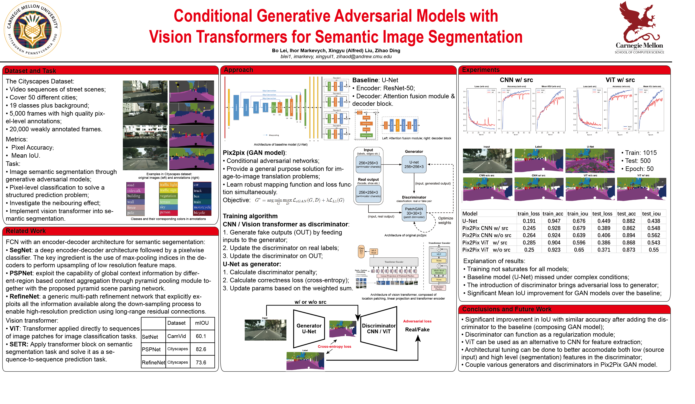

# pix2pix_for_image_segmentation
## Motivation
This is the course project of 10-708: Probabilistic Graphical Models.

We try to solve semantic image segmentation on cityscapes using pix2pix model. The accuracy is improved compared with a U-Net baseline thanks to this GAN model.

In addition, we introduce the Vision Transformer (ViT)component. It can be used either as an independent model for image segmentation, or as a component for generator/discriminator in the GAN. As an alternative to convolutional neural network (CNN), it shows great potential in vision tasks.



## Download Dataset
Follow instructions from https://github.com/mcordts/cityscapesScripts

1. Install the official CityScapes dataset module

```
pip install cityscapesscripts
```

2. Install the segmentation models from https://github.com/qubvel/segmentation_models.pytorch

```
pip install segmentation-models-pytorch
```

3. Register an account from https://www.cityscapes-dataset.com/register/

4. Download and extract data to folder `data/cityscapes`. Data size is 12GB.

```
csDownload gtFine_trainvaltest.zip leftImg8bit_trainvaltest.zip -d data/cityscapes
unzip -q data/cityscapes/gtFine_trainvaltest.zip
unzip -q data/cityscapes/leftImg8bit_trainvaltest.zip
```


OR:

```
wget --keep-session-cookies --save-cookies=cookies.txt --post-data 'username=myusername&password=mypassword&submit=Login' https://www.cityscapes-dataset.com/login/
wget --load-cookies cookies.txt --content-disposition https://www.cityscapes-dataset.com/file-handling/?packageID=1
wget --load-cookies cookies.txt --content-disposition https://www.cityscapes-dataset.com/file-handling/?packageID=3
```
